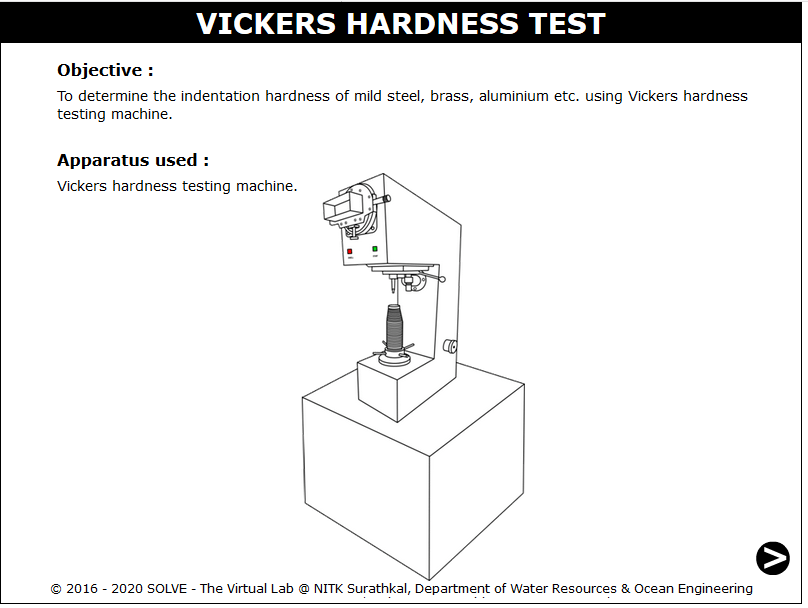
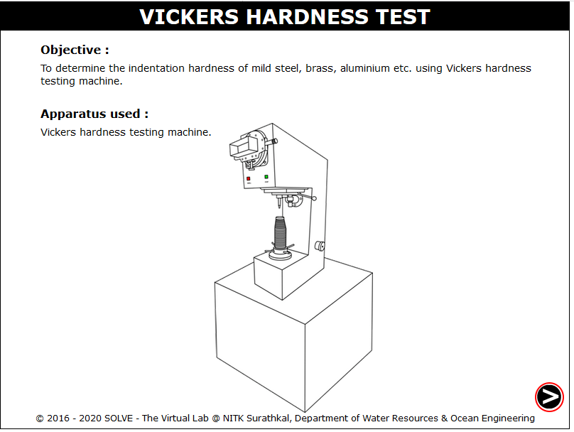
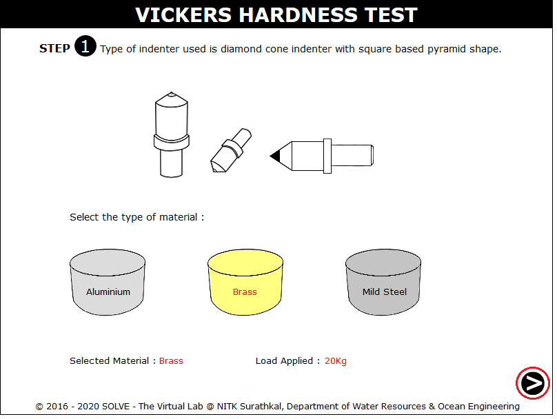
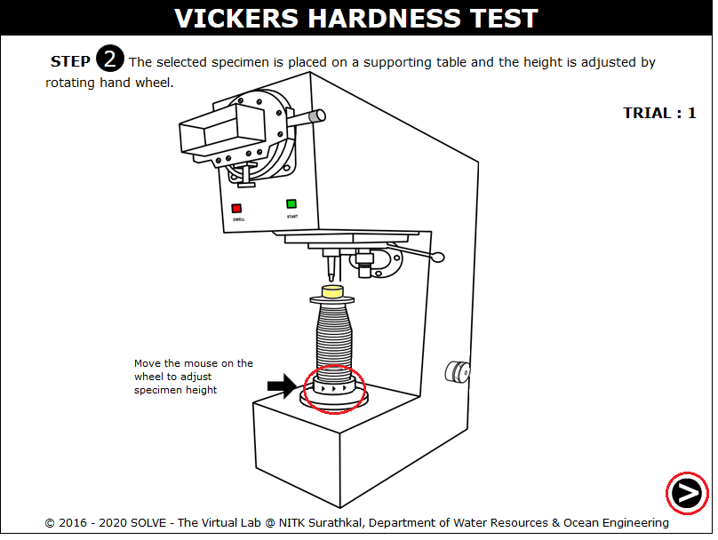
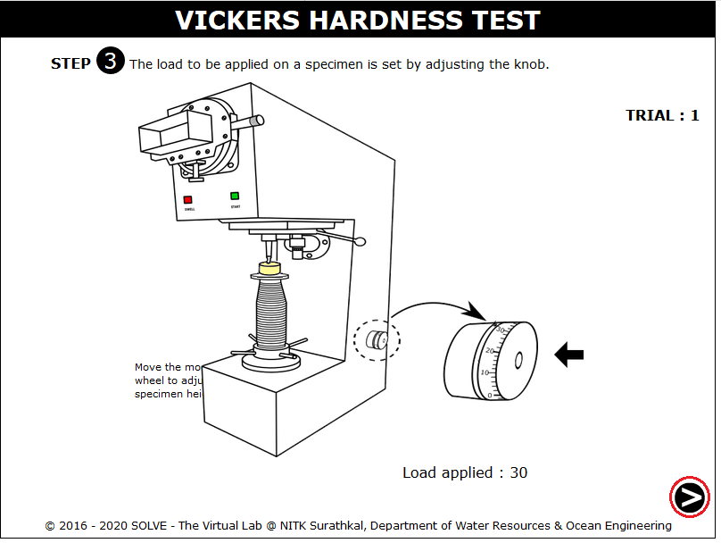
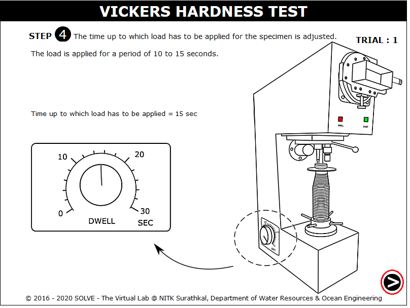
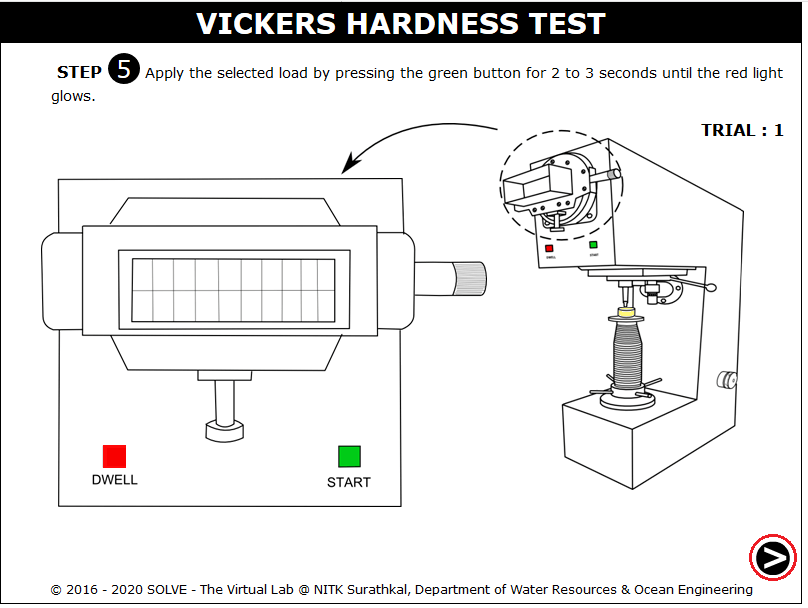
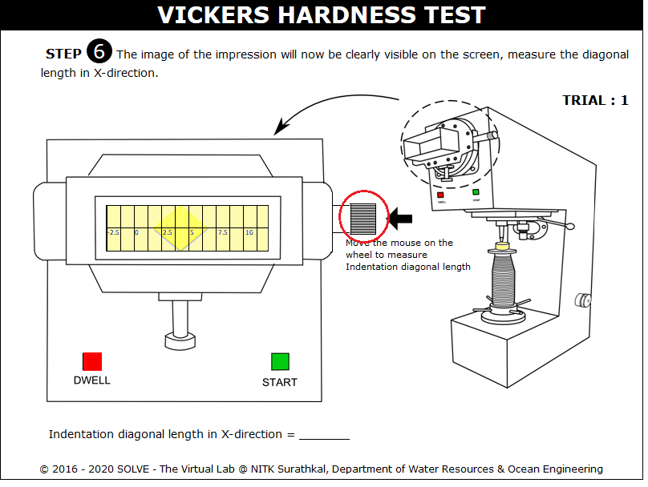
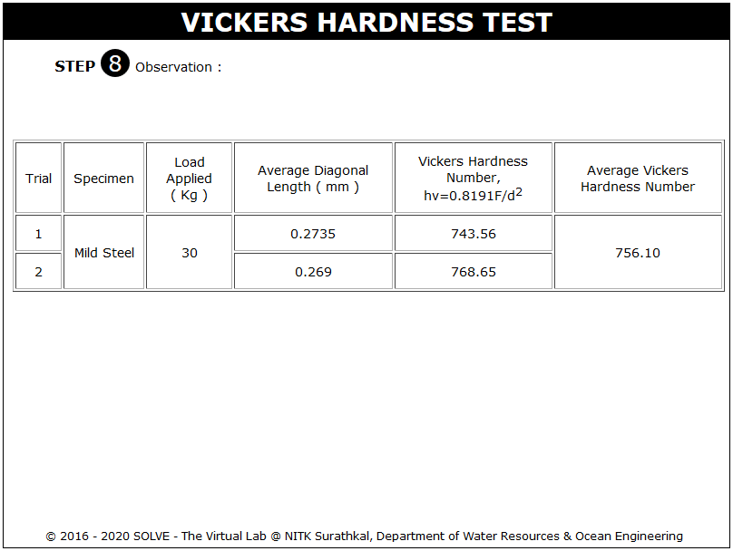

**OBJECTIVE**:

To determine the indentation hardness of mild steel, brass, aluminium etc. using Vickers hardness testing machine.

**STEPS**:

1. When you click on a Vicker's Hardness test file, a new window will open as shown below.  
   

2. Click on the NEXT button to move to the next step.  
   

3. Click on the specimen to select the material for testing.  
   

4. Move mouse over the rotating wheel to adjust the height of the specimen.  
   

5. Standard load is applied on the specimen by clicking on the Knob.  
   

6. Click on the time setting knob to adjust the time to apply load.  
   

7. Loading on the specimen is done by pressing the green button for 2 to 3 seconds until the red light glows.  
   

8. Impression of the specimen is available on the screen rotate the adjusting screw to adjust the corner of diagonal to zero.  
   

9. Results of all the trial.  
   
