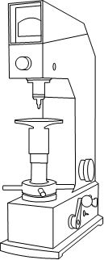
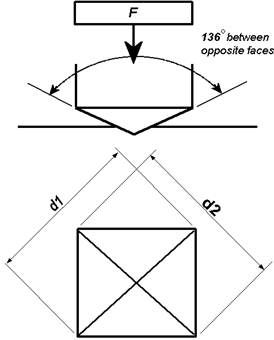
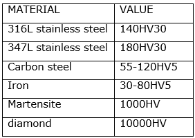
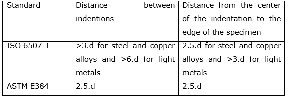

The Vickers hardness test was developed by RL. Smith and Sandland in 1921 at Vickers Ltd as an alternative to brinell hardness test method to measure the hardness of the material. The Vickers hardness test follows the brinell principle, in that an indenter of definite shape is pressed into the material to be tested, then the load is removed and the diagonals of the resulting indentation are measured from these the hardness number is calculated by dividing the load by the surface area of indentation.

Vickers hardness testing machine

The Vickers test is easier than other hardness tests since the required calculations are independent of the size of the indenter and the indenter can be used for all materials irrespective of hardness.

**Principle**

The indenter is made of diamond and is in the form of a square-based pyramid with an angle of 1360 between faces. The faces of diamond indenter are highly polished, and the point is sharp. The loads applied vary from 1 to 120 kg; the standard loads are 5, 10, 20, 30, 50, 100, and 120 kg. For most hardness testing, 50 kg is maximum.

The Vickers test can be used for all metals and is one of the widely used test among hardness tests. The unit of hardness is known as the VICKERS PYRAMID NUMBER (HV) or DIAMOND PYRAMID HARDNESS (DPH). The hardness number can be calculated by the load over the surface area of the indentation.

**Implementation**

The angle between the two faces of diamond indenter used in Vickers hardness test is 136&deg; and the faces makes an angle 22&deg; with the horizontal. The HV number is then determined by the ratio F/A, where F is the force applied to the diamond in kilograms-force and A is the surface area of the indentation in square millimeters. A can be determined by the formula.

A=d2/2sin(136°/2)ʹ

by eliminating the sine term we get,

A=d2/1.8544ʹ

Where d is the average length of the diagonal in millimeters. Hence,

HV=F/A=(1.8544F/d2)kgf/mm2

Where F is in kgf and d is in millimeters.

The corresponding units of HV are then kilograms-force per square millimeter (kgf/mm). To calculate Vickers hardness number using SI units we must convert the force applied from kilogram-force to Newtons by multiplying by 9.80665 (standard gravity) and then dividing by 1000 to get the answer in GPa. This will leads to the following equation that can be used to do any calculation directly.

HV=0.1891(F/d2)GPa

Where F is in N and d is in millimeters.

Vickers hardness numbers are expressed as xxxHVyy, e.g.440HV30, or xxxHVyy/zz if duration of force differs from 10 s to 15 s, e.g.440HV30/20,Where:

440 is the hardness number,

HV gives the hardness scale (Vickers),

30 is the load used in kgf.

20 is loading time if it differs from 10s to 15s

Vickers values are not dependent of the test force: they will be same for 500gf and 50kgf, as long as the force is at least 200 gf.

For thin samples indentation depth can be an issue due to substrate effects. In other waysindent depth can be calculated according to:

h=d/2√2 tan(136°/2 )=d/7.0006ʹ

Examples of HV values for various materials

**Test specimen**

The test should be carried out on a surface which is smooth, even, free from oxide, foreign matter and lubricants.The thickness of the test piece or of the layer under test shall be at least 1.5 times the diagonal length of the indentation.For test piece of small cross section or of irregular shape, it may be necessary to provide some form of additional support.

**Precautions**:

When doing the hardness tests the distance between indentations and the distance from the indentation to the edge of the specimen must be taken into account. These minimum distances are different for ISO 6507-1 and ASTM E384 standards.

**RELEVANT INDIAN STANDARD FOR VICKERS HARDNESS TEST**:

1. IS 1501:2002, method for Vickers hardness test for metallic materials.
